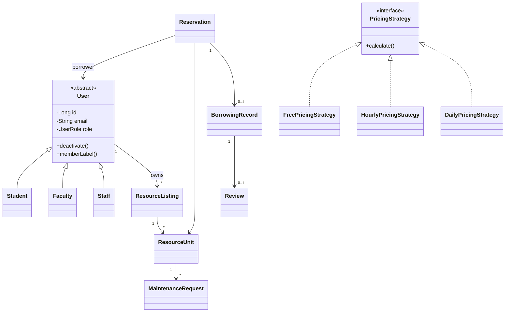
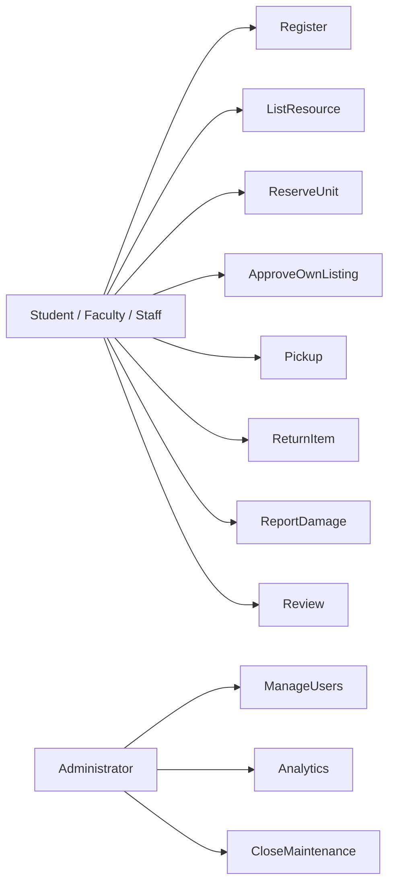
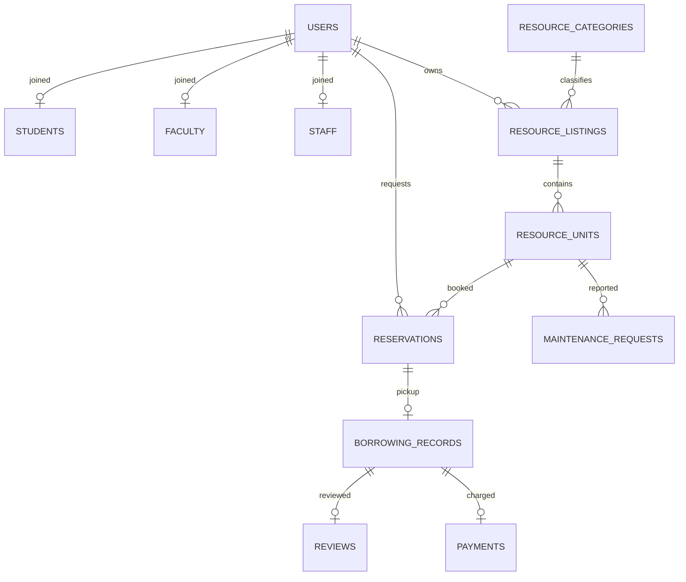

# Diagrams

## Class diagram

```mermaid
classDiagram
    class User {
      <<abstract>>
      -Long id
      -String email
      -UserRole role
      +deactivate()
      +memberLabel()
    }
    class Student
    class Faculty
    class Staff
    User <|-- Student
    User <|-- Faculty
    User <|-- Staff
    class ResourceListing
    class ResourceUnit
    class Reservation
    class BorrowingRecord
    class MaintenanceRequest
    class Review
    class PricingStrategy {
      <<interface>>
      +calculate()
    }
    User "1" --> "*" ResourceListing : owns
    ResourceListing "1" --> "*" ResourceUnit
    Reservation --> User : borrower
    Reservation --> ResourceUnit
    Reservation "1" --> "0..1" BorrowingRecord
    ResourceUnit "1" --> "*" MaintenanceRequest
    BorrowingRecord "1" --> "0..1" Review
    PricingStrategy <|.. FreePricingStrategy
    PricingStrategy <|.. HourlyPricingStrategy
    PricingStrategy <|.. DailyPricingStrategy
```

## Use cases

```mermaid
flowchart LR
    student[Student / Faculty / Staff]
    admin[Administrator]
    student --> Register
    student --> ListResource
    student --> ReserveUnit
    student --> ApproveOwnListing
    student --> Pickup
    student --> ReturnItem
    student --> ReportDamage
    student --> Review
    admin --> ManageUsers
    admin --> Analytics
    admin --> CloseMaintenance
```

## ER

```mermaid
erDiagram
    USERS ||--o| STUDENTS : joined
    USERS ||--o| FACULTY : joined
    USERS ||--o| STAFF : joined
    USERS ||--o{ RESOURCE_LISTINGS : owns
    RESOURCE_CATEGORIES ||--o{ RESOURCE_LISTINGS : classifies
    RESOURCE_LISTINGS ||--o{ RESOURCE_UNITS : contains
    USERS ||--o{ RESERVATIONS : requests
    RESOURCE_UNITS ||--o{ RESERVATIONS : booked
    RESERVATIONS ||--o| BORROWING_RECORDS : pickup
    RESOURCE_UNITS ||--o{ MAINTENANCE_REQUESTS : reported
    BORROWING_RECORDS ||--o| REVIEWS : reviewed
    BORROWING_RECORDS ||--o| PAYMENTS : charged
```
